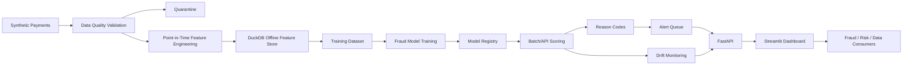

# Payments Fraud Feature Store + MLOps Pipeline


## Executive Summary

Banks, fintechs, payment processors, card networks, and large retailers need fraud systems that are fast, explainable, monitored, and production-ready. A notebook-only fraud model is not enough: production teams also need trusted transaction data, point-in-time features, model registry artifacts, reason codes, alert queues, drift monitoring, APIs, dashboards, and repeatable validation evidence.

This project builds that workflow locally with synthetic payment data. It proves the engineering system around fraud ML, not just model training.

Core question:

> Can this transaction be scored for fraud risk using trusted features, monitored model behavior, and explainable reason codes?

## What Was Built

- Synthetic customers, accounts, merchants, devices, transactions, chargebacks, fraud labels, and risk profiles.
- Fraud pattern injection and data quality issue injection with deterministic manifests.
- Data quality validation, quarantine, and detection evidence.
- Point-in-time feature engineering for customer, merchant, device, velocity, and transaction features.
- DuckDB offline feature store at `data/features/fraud_feature_store.duckdb`.
- Deterministic scikit-learn RandomForest fraud model with model card and registry artifact.
- Batch and API scoring with risk bands, reason codes, recommended actions, and alert queue.
- Drift monitoring, model monitoring, fraud pattern evidence, feature store quality reports, and scorecards.
- FastAPI service, Streamlit dashboard, Docker files, GitHub Actions, and 61 passing tests.

## Why This Is Not A Notebook Fraud Model

Most portfolio fraud projects stop after training a classifier. This project demonstrates the production lifecycle that senior data and MLOps reviewers expect to see:

- Data is generated, validated, and quarantined before modeling.
- Features are point-in-time safe so they do not leak future information.
- Feature outputs are stored in a local offline feature store.
- Model metrics, registry metadata, and model-card documentation are written as artifacts.
- Scores include reason codes and recommended actions for fraud operations.
- Monitoring reports track drift and score distribution changes.
- API and dashboard layers make the system demo-ready.
- Tests and ruff validation make the repo reproducible from a fresh clone.

## Architecture



## MLOps Lifecycle Demonstrated

- Data generation: deterministic synthetic payment events, entities, labels, chargebacks, and risk profiles.
- Validation: required fields, foreign keys, invalid values, closed-account transactions, future timestamps, and other quality checks.
- Feature engineering: point-in-time customer, merchant, device, velocity, and transaction features.
- Feature store: DuckDB offline table plus metadata and quality scorecards.
- Training: deterministic RandomForest baseline from the feature store.
- Evaluation: precision, recall, F1, ROC AUC, PR AUC, capture rates, false positive rate, and confusion matrix.
- Registry: model version, thresholds, metrics, artifact path, limitations, intended use, and approval flag.
- Scoring: batch scoring and single-transaction API scoring.
- Reason codes: operational explanations such as high velocity, risky merchant, amount outlier, and international mismatch.
- Alert queue: high and critical risk transactions prioritized for review or decline.
- Monitoring: PSI, mean shift, missing-rate change, fraud score shift, risk-band distribution, and monitoring score.
- Serving: FastAPI endpoints and Streamlit dashboard views for reviewers and demo users.

## Evidence Generated By The Pipeline

These files are created by `python -m src.pipeline.run_all` and are useful for both recruiters and senior technical reviewers:

- `data/scorecards/fraud_pattern_detection_report.json` / `.csv`: compares injected fraud patterns against scored risk outcomes.
- `data/scorecards/data_quality_detection_report.json` / `.csv`: compares injected data quality issues against detected validation issues.
- `data/scorecards/point_in_time_feature_validation.json` / `.csv`: shows sampled features only used historical transactions.
- `data/scorecards/feature_store_quality_report.json` / `.csv`: summarizes row count, feature count, missing rates, zero-variance checks, freshness, group scores, and overall feature store quality.
- `data/scorecards/fraud_model_scorecard.json` / `.csv`: captures model metrics, training/test sizes, fraud rates, threshold, risk-band distribution, and feature importances.
- `data/scorecards/reason_code_report.json` / `.csv`: measures reason-code coverage and frequency across scored transactions and alerts.
- `data/scorecards/alert_queue_quality_report.json` / `.csv`: summarizes alert volume, risk bands, recommended actions, fraud rate in alerts, and alert queue quality.
- `data/scorecards/model_monitoring_scorecard.json` / `.csv`: summarizes feature drift, score drift, risk-band shift, drift severity, and monitoring score.

## Key Scorecards

The project writes business-readable scorecards that answer practical review questions:

- Did the pipeline detect known synthetic fraud patterns?
- Did data quality checks catch the injected bad records?
- Are features point-in-time safe?
- Is the feature store complete and fresh enough for modeling?
- How did the model perform on synthetic fraud labels?
- Do high-risk scores include reason codes?
- Is the alert queue usable for fraud operations?
- Is the scoring population drifting?

## Quickstart

```bash
git clone https://github.com/mohilamin/payments-fraud-feature-store-mlops.git
cd payments-fraud-feature-store-mlops

conda create -n fraud-mlops python=3.12 -y
conda activate fraud-mlops
python -m pip install --upgrade pip
python -m pip install -r requirements.txt
```

Run the pipeline and checks:

```bash
python -m src.data_generation.generate_synthetic_payments
python -m src.pipeline.run_all
python -m pytest
python -m ruff check .
```

Launch the API:

```bash
python -m uvicorn src.api.main:app --reload
```

Launch the dashboard:

```bash
python -m streamlit run src/dashboard/app.py
```

See [docs/fresh-clone-validation.md](docs/fresh-clone-validation.md) for a complete fresh-clone validation script.

## API Examples

```bash
curl http://127.0.0.1:8000/fraud-summary
curl http://127.0.0.1:8000/features
curl http://127.0.0.1:8000/model-card
curl http://127.0.0.1:8000/monitoring/drift
```

```bash
curl -X POST http://127.0.0.1:8000/score-transaction \
  -H "Content-Type: application/json" \
  -d '{"transaction_id":"demo","amount":950,"customer_txn_count_1h":8,"international_mismatch_flag":1,"new_device_flag":1}'
```

## Dashboard

The Streamlit dashboard includes executive KPIs, fraud model performance, feature store quality, fraud alerts, transaction scoring lab, reason-code explorer, drift monitoring, data quality issues, model card, and investigator queue views.

Screenshot capture guidance lives in [docs/screenshots](docs/screenshots).

## Testing And Validation

Current validation status:

- `python -m src.data_generation.generate_synthetic_payments` passed
- `python -m src.pipeline.run_all` passed
- `python -m pytest` passed: 61 tests
- `python -m ruff check .` passed
- Pytest warning summary cleaned

The tests cover synthetic generation, manifests, ingestion, data quality detection, quarantine, point-in-time features, feature store creation, model training, registry, scoring, reason codes, alert queue, PSI edge cases, evidence reports, API schemas, and full pipeline execution.

## Known Limitations

- Synthetic data only.
- Local DuckDB feature store instead of a managed enterprise feature platform.
- Baseline scikit-learn RandomForest model, not a production fraud model.
- Deterministic reason codes, not SHAP or full model explainability.
- Batch monitoring only.
- No live Kafka stream.
- No cloud deployment.
- No authentication or role-based access.
- No MLflow or Feast integration yet.

## Future Enhancements

- Kafka or Redpanda streaming ingestion.
- Feast feature store.
- MLflow experiment tracking and model registry.
- SHAP reason codes.
- Spark or Databricks scaling.
- Snowflake warehouse version.
- Airflow orchestration.
- Cloud deployment.
- Authentication and role-based access.
- Real-time drift alerts.

## Project Status

V0.3 Showcase Polish: public-ready README, demo guidance, screenshot capture instructions, recruiter summary, technical deep dive, fresh-clone validation, GitHub profile setup, LinkedIn drafts, release notes, and validation proof.
