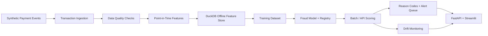

# Payments Fraud Feature Store + MLOps Pipeline


## Executive Summary

Banks, fintechs, payment processors, card networks, and large retailers need fraud systems that are fast, explainable, monitored, and production-ready. A notebook model is not enough. This project builds a local end-to-end fraud feature store and MLOps pipeline with synthetic payment events, quality checks, point-in-time features, model training, registry artifacts, scoring, reason codes, drift monitoring, fraud alerts, FastAPI, Streamlit, tests, CI, and Docker.

Core question:

> Can this transaction be scored for fraud risk using trusted features, monitored model behavior, and explainable reason codes?

## Architecture



## What Was Built

- Synthetic customers, accounts, merchants, devices, transactions, labels, chargebacks, and risk profiles.
- Fraud pattern manifest and data quality issue manifest.
- Quality validation and transaction quarantine.
- Point-in-time customer, merchant, device, and transaction features.
- Local DuckDB offline feature store.
- RandomForestClassifier baseline model.
- Model metrics, model card, and registry artifact.
- Batch and API scoring with reason codes.
- Risk bands and recommended actions.
- Fraud alert queue.
- Feature drift, score distribution, and model performance monitoring.
- FastAPI service and Streamlit operations dashboard.
- pytest, Ruff, Docker, and GitHub Actions.

## Key Outputs

- `data/raw/injected_fraud_pattern_manifest.json`
- `data/raw/injected_data_quality_manifest.json`
- `data/processed/data_quality_issues.csv`
- `data/processed/quarantine/payment_transactions_quarantine.csv`
- `data/features/transaction_features.csv`
- `data/features/fraud_feature_store.duckdb`
- `models/artifacts/fraud_model.joblib`
- `models/registry/model_registry.json`
- `data/scoring/scored_transactions.csv`
- `data/alerts/fraud_alert_queue.csv`
- `data/monitoring/feature_drift_summary.json`
- `data/scorecards/fraud_model_scorecard.json`

## Quickstart

```bash
git clone https://github.com/mohilamin/payments-fraud-feature-store-mlops.git
cd payments-fraud-feature-store-mlops

python3.12 -m venv .venv
source .venv/bin/activate
python -m pip install --upgrade pip
python -m pip install -r requirements.txt
```

Run the pipeline:

```bash
python -m src.data_generation.generate_synthetic_payments
python -m src.pipeline.run_all
python -m pytest
python -m ruff check .
```

Launch the API:

```bash
python -m uvicorn src.api.main:app --reload
```

Launch the dashboard:

```bash
python -m streamlit run src/dashboard/app.py
```

## API Endpoints

- `GET /health`
- `GET /features`
- `GET /model-card`
- `GET /monitoring/drift`
- `GET /alerts`
- `POST /score-transaction`
- `POST /score-batch`
- `GET /scorecards`
- `GET /fraud-summary`

Example scoring request:

```bash
curl -X POST http://127.0.0.1:8000/score-transaction \
  -H "Content-Type: application/json" \
  -d '{"transaction_id":"demo","amount":950,"customer_txn_count_1h":8,"international_mismatch_flag":1,"new_device_flag":1}'
```

## Feature Store

The offline feature store is stored in DuckDB at `data/features/fraud_feature_store.duckdb`. The main table is `transaction_features`, keyed by `transaction_id`. V0.1 features are calculated with prior rolling windows so future transactions are not used for historical feature values.

## MLOps and Monitoring

The model lifecycle includes a training dataset, model artifact, model registry JSON, model card, batch scoring output, alert queue, scoring quality report, feature drift report, score distribution report, and model performance report.

## STAR Story

Situation: payment organizations need fraud systems that go beyond notebook modeling and support reliable features, explainability, monitoring, and investigator workflows.

Task: build a local end-to-end feature store and MLOps pipeline for synthetic payment fraud scoring.

Action: implemented synthetic data generation, fraud injection, quality validation, point-in-time features, DuckDB feature store, scikit-learn training, model registry, scoring, reason codes, alerts, monitoring, API, dashboard, tests, CI, and Docker.

Result: created a reproducible portfolio project demonstrating production-style fraud detection foundations with feature engineering, model scoring, explainability, monitoring, and operational evidence.

## Known Limitations

- Synthetic data only.
- Deterministic baseline model, not a production fraud model.
- Local DuckDB feature store instead of Feast/Tecton/Snowflake/Databricks.
- Deterministic reason codes instead of SHAP.
- Local batch-style monitoring instead of a live monitoring service.
- No authentication or cloud deployment yet.

## Future Enhancements

- MLflow model tracking.
- Feast feature store.
- Kafka or Redpanda streaming ingestion.
- SHAP explanations.
- Airflow orchestration.
- Spark, Snowflake, or Databricks scale-out version.
- Role-based API authentication.
- Cloud deployment.

## Project Status

V0.1: first working local fraud feature store and MLOps pipeline.
