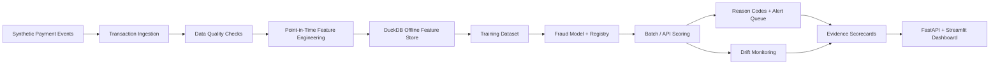

# Payments Fraud Feature Store + MLOps Pipeline


## Executive Summary

Banks, fintechs, payment processors, card networks, and large retailers need fraud systems that are fast, explainable, monitored, and production-ready. A notebook model is not enough. This project builds a local end-to-end fraud feature store and MLOps pipeline with synthetic payment events, quality checks, point-in-time features, model training, registry artifacts, scoring, reason codes, drift monitoring, fraud alerts, FastAPI, Streamlit, tests, CI, and Docker.

Core question:

> Can this transaction be scored for fraud risk using trusted features, monitored model behavior, and explainable reason codes?

## Why This Is Not a Notebook Fraud Model

This project does not stop at model fitting. It shows the surrounding production workflow: transaction ingestion, known data quality issue detection, point-in-time feature validation, DuckDB offline feature storage, model registry artifacts, scorecards, reason codes, alert queues, monitoring reports, API scoring, dashboard review, and automated tests.

## Architecture



## V0.2 Evidence Outputs

- Fraud pattern detection: `data/scorecards/fraud_pattern_detection_report.json`
- Data quality detection: `data/scorecards/data_quality_detection_report.json`
- Point-in-time validation: `data/scorecards/point_in_time_feature_validation.json`
- Feature store quality: `data/scorecards/feature_store_quality_report.json`
- Model scorecard: `data/scorecards/fraud_model_scorecard.json`
- Reason-code coverage: `data/scorecards/reason_code_report.json`
- Alert queue quality: `data/scorecards/alert_queue_quality_report.json`
- Monitoring scorecard: `data/scorecards/model_monitoring_scorecard.json`

## Feature Store

The offline feature store is stored in DuckDB at `data/features/fraud_feature_store.duckdb`. The core table is `transaction_features`, keyed by `transaction_id`. V0.2 validates that customer, merchant, and device history features use only events before the scored transaction timestamp.

Feature groups:

- Customer velocity and spend behavior
- Merchant volume, fraud, chargeback, and risk profile
- Device activity and risk profile
- Transaction context such as international mismatch and card-not-present risk
- Velocity flags used by reason codes and model scoring

## MLOps Lifecycle

The pipeline creates a training dataset, trains a deterministic RandomForest baseline, writes a model artifact, registers model metadata, generates a model card, scores transactions, produces fraud alerts, and writes monitoring reports. The goal is not maximum fraud accuracy; the goal is to show a reproducible production-style workflow.

## Model Scorecard

The model scorecard includes precision, recall, F1, ROC AUC, PR AUC, confusion matrix, false positive rate, top 1/5/10 percent fraud capture rates, risk-band distribution, training/test row counts, fraud rates, threshold, and top feature importances.

## Reason-Code Explainability

Every scored transaction receives deterministic reason codes where applicable. V0.2 tracks reason-code coverage and frequency across alerts. Example reason codes include:

- `HIGH_VELOCITY_CUSTOMER`
- `NEW_DEVICE_HIGH_VALUE`
- `INTERNATIONAL_MISMATCH`
- `RISKY_MERCHANT`
- `AMOUNT_OUTLIER`
- `CARD_NOT_PRESENT_RISK`
- `IMPOSSIBLE_TRAVEL`

## Drift Monitoring

Monitoring reports include PSI by feature, mean shift, missing-rate change, fraud score distribution shift, risk-band distribution, drift severity, and a monitoring summary score. In production, this could connect to a live model monitoring service.

## Quickstart

```bash
git clone https://github.com/mohilamin/payments-fraud-feature-store-mlops.git
cd payments-fraud-feature-store-mlops

python3.12 -m venv .venv
source .venv/bin/activate
python -m pip install --upgrade pip
python -m pip install -r requirements.txt
```

Run the pipeline and checks:

```bash
python -m src.data_generation.generate_synthetic_payments
python -m src.pipeline.run_all
python -m pytest
python -m ruff check .
```

Launch the API:

```bash
python -m uvicorn src.api.main:app --reload
```

Launch the dashboard:

```bash
python -m streamlit run src/dashboard/app.py
```

## API Examples

```bash
curl http://127.0.0.1:8000/fraud-summary
curl http://127.0.0.1:8000/model-card
curl http://127.0.0.1:8000/monitoring/drift
```

```bash
curl -X POST http://127.0.0.1:8000/score-transaction \
  -H "Content-Type: application/json" \
  -d '{"transaction_id":"demo","amount":950,"customer_txn_count_1h":8,"international_mismatch_flag":1,"new_device_flag":1}'
```

## Dashboard

The Streamlit dashboard includes executive KPIs, fraud model scorecard, feature store quality, fraud pattern detection, data quality detection, point-in-time validation, reason-code explorer, alert queue quality, drift monitoring, transaction scoring lab, and model card.

## Testing

Current V0.2 validation: `61 passed`.

The tests cover synthetic generation, manifests, ingestion, data quality detection, quarantine, point-in-time features, feature store creation, model training, registry, scoring, reason codes, alert queue, PSI edge cases, evidence reports, API schemas, and full pipeline execution.

## Known Limitations

- Synthetic data only.
- Deterministic baseline model, not a production fraud model.
- Local DuckDB feature store instead of Feast, Tecton, Snowflake, or Databricks.
- Deterministic reason codes instead of SHAP.
- Local batch-style monitoring instead of a live monitoring service.
- No authentication, human workflow system, or cloud deployment yet.

## Future Enhancements

- MLflow model tracking.
- Feast feature store.
- Kafka or Redpanda streaming ingestion.
- SHAP explanations.
- Airflow orchestration.
- Spark, Snowflake, or Databricks scale-out version.
- Role-based API authentication.
- Cloud deployment.

## Project Status

V0.2: evidence hardening for fraud pattern detection, data quality detection, point-in-time validation, model scorecards, reason codes, alert queue quality, monitoring, API, dashboard, docs, and tests.
