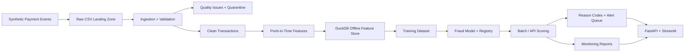

# Data Flow

```mermaid
flowchart LR
    A["Synthetic Payment Events"] --> B["Raw CSV Landing Zone"]
    B --> C["Ingestion + Validation"]
    C --> D["Quality Issues + Quarantine"]
    C --> E["Clean Transactions"]
    E --> F["Point-in-Time Features"]
    F --> G["DuckDB Offline Feature Store"]
    G --> H["Training Dataset"]
    H --> I["Fraud Model + Registry"]
    I --> J["Batch / API Scoring"]
    J --> K["Reason Codes + Alert Queue"]
    J --> L["Monitoring Reports"]
    K --> M["FastAPI + Streamlit"]
    L --> M
```
